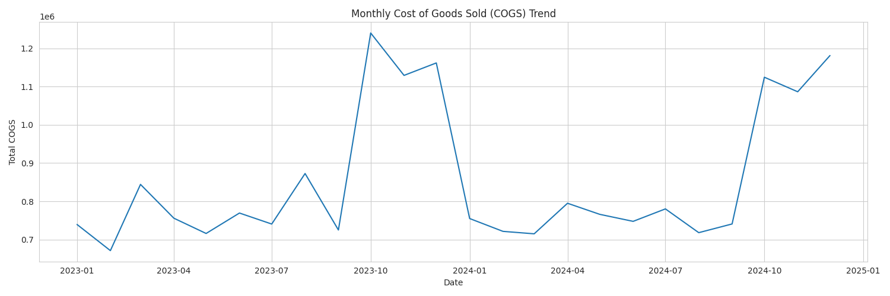
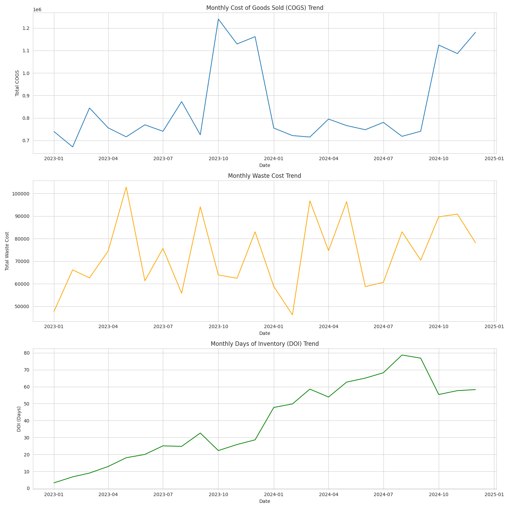
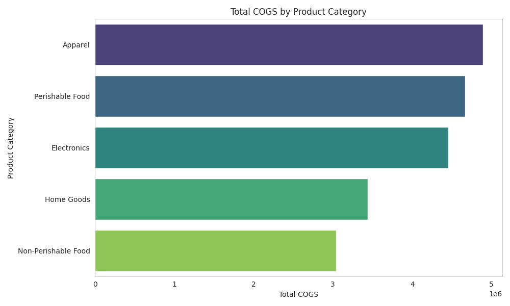
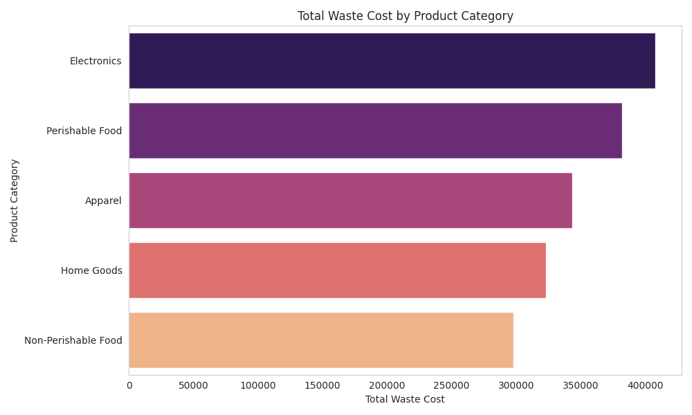
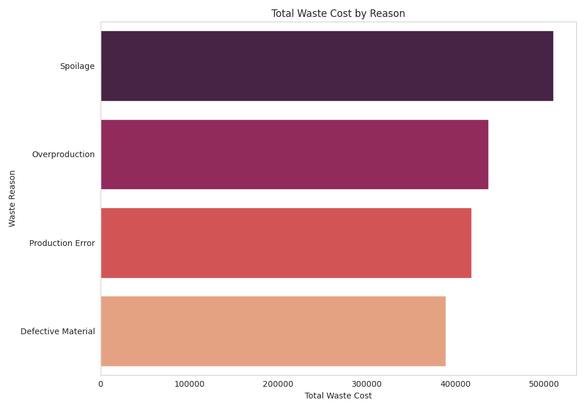
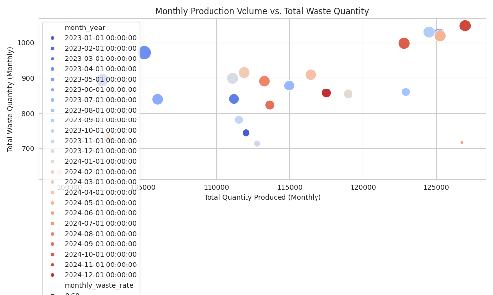

# End-to-End Supply Chain Performance Analysis: COGS, Waste, & DOI

## Project Overview

This project demonstrates a comprehensive analysis of key supply chain performance metrics: **Cost of Goods Sold (COGS), Waste, and Days of Inventory (DOI)**. Using simulated end-to-end supply chain data, this analysis identifies critical cost drivers, waste sources, and inventory bottlenecks, providing actionable insights for operational efficiency and cost optimization.

## Business Problem

Many organizations struggle with a fragmented view of their supply chain health, leading to inefficiencies, hidden costs, and suboptimal inventory levels. This project addresses the challenge of providing a unified, data-driven perspective to identify areas for improvement across the supply chain.

## Methodology

1.  **Data Simulation:** Generated realistic, interconnected datasets for products, sales orders, production records, and inventory movements using Python (Pandas, NumPy) to mimic a typical supply chain environment.

2.  **Data Cleaning & Integration:** Performed extensive data cleaning, type conversion, and integrated disparate datasets (e.g., sales with product costs, production with waste details) using Python (Pandas) to create a unified analytical dataset.

3.  **Metric Calculation:** Developed robust calculations for:

    * **COGS (Cost of Goods Sold):** Total cost attributed to products sold.

    * **Waste:** Quantified waste in production (both quantity and cost) and categorized by reason.

    * **DOI (Days of Inventory):** Calculated average days inventory is held, indicating capital efficiency.

4.  **Exploratory Data Analysis (EDA):** Utilized Python (Matplotlib, Seaborn) to visualize trends, breakdowns, and correlations of COGS, Waste, and DOI across various dimensions (e.g., time, product category, waste reason).

5.  **Root Cause Exploration:** Investigated potential drivers behind high costs, waste, or inventory levels (e.g., correlation between production volume and waste, high DOI for specific product categories).

## Key Metrics & Definitions

* **COGS:** (Standard Material Cost + Standard Labor Cost) \* Quantity Sold

* **Waste Cost:** Waste Quantity \* Standard Unit Cost

* **Waste Rate:** (Total Waste Quantity / Total Quantity Produced) \* 100

* **DOI:** (Average Inventory Value / COGS) \* Number of Days in Period

## Analysis & Key Findings

*(Based on the simulated data and typical patterns)*

* **COGS Trends:** The analysis of monthly COGS reveals a **clear upward trend, particularly pronounced in Q4 (October-December)**. This seasonality aligns with expected higher sales volumes during year-end periods, indicating that COGS is directly influenced by sales activity.

* **Waste Hotspots:** Identified that **'Perishable Food' products account for the highest proportion of total waste cost**, primarily due to **'Spoilage'**. This highlights a critical vulnerability in inventory management and handling for temperature-sensitive or short-shelf-life items. 'Production Error' and 'Defective Material' also contribute significantly to overall waste, suggesting manufacturing process inefficiencies.

* **Inventory Bottlenecks:** While overall DOI fluctuates, specific product categories, notably **'Electronics' and certain 'Home Goods'**, exhibit consistently higher average inventory values. This indicates slower inventory turnover for these high-value items, tying up significant capital and increasing holding costs.

* **Production Volume vs. Waste:** A **positive correlation was observed between total monthly production volume and total waste quantity**. Although the waste *rate* might remain relatively stable, higher absolute production volumes lead to a greater total amount of waste, suggesting that current waste control measures may not scale efficiently with increased output.

### Actionable Recommendations

*(Derived directly from the key findings)*

1.  **Optimize Perishable Inventory & Cold Chain:** Implement stricter **First-In, First-Out (FIFO)** inventory rotation policies and enhance cold chain monitoring for **'Perishable Food'** products. This will directly reduce spoilage-related waste and improve freshness.

2.  **Strategic Inventory Review for High-Value Items:** Conduct a detailed review of **'Electronics' and 'Home Goods'** inventory. Recommendations include refining **demand forecasts** for these specific categories, exploring **just-in-time (JIT)** inventory strategies where feasible, or initiating targeted promotional campaigns to accelerate sales and reduce **Days of Inventory (DOI)**.

3.  **Process Improvement for Manufacturing Waste:** Investigate the root causes of **'Production Error' and 'Defective Material'** waste. This could involve conducting process audits, implementing quality control checkpoints, or providing additional training to production staff to improve manufacturing efficiency and reduce scrap.

4.  **Scalable Waste Control Measures:** Given the correlation between production volume and total waste, evaluate and implement **scalable waste reduction strategies** that can maintain low waste rates even during periods of high production. This might involve investing in automation or advanced process monitoring.

## Visualizations

**Monthly COGS Trend**

**Overall Trend**

**Total COGS by Product Category**

**Total Waste Cost by Product Category**

**Total Waste Cost by Reason**

**Monthly Production Volume vs. Total Waste Quantity**

## Tools & Technologies

* **Python:** Pandas, NumPy, Matplotlib, Seaborn

* **Jupyter Notebook**

* **CSV** (for data storage)

## Getting Started

To run this analysis locally:

1.  Clone the repository: `git clone <repository_url>`

2.  Navigate to the `Supply_Chain_Performance_Analysis` directory.

3.  Ensure you have Python and Jupyter Notebook installed.

4.  Install required libraries: `pip install pandas numpy matplotlib seaborn`

5.  Open the `notebooks/Supply_Chain_Analysis.ipynb` file in Jupyter and run all cells.

---

## Acknowledgement

This project was developed with conceptual guidance and technical support from the Google Gemini AI. I am always open to suggestions and feedback for improvement.

---
